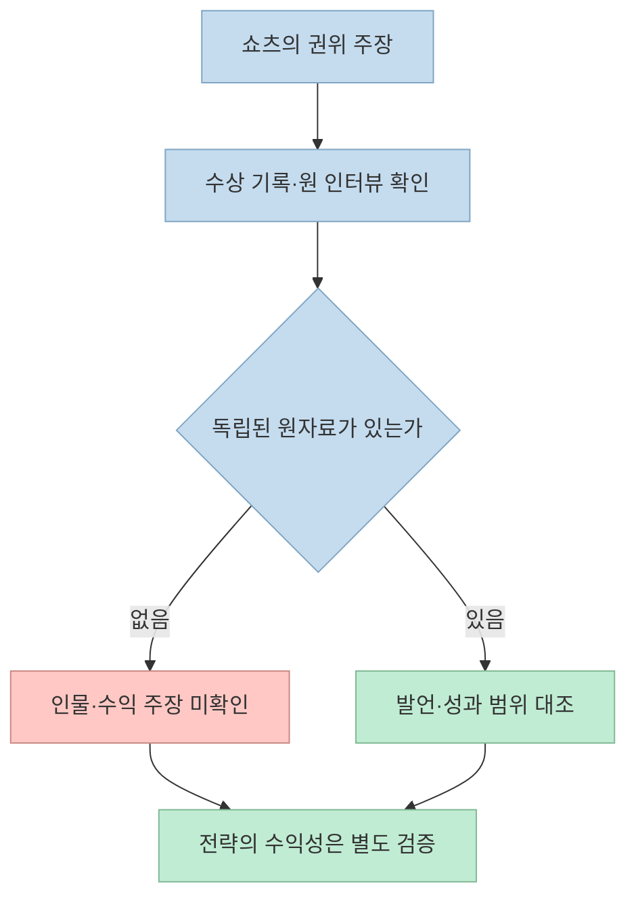
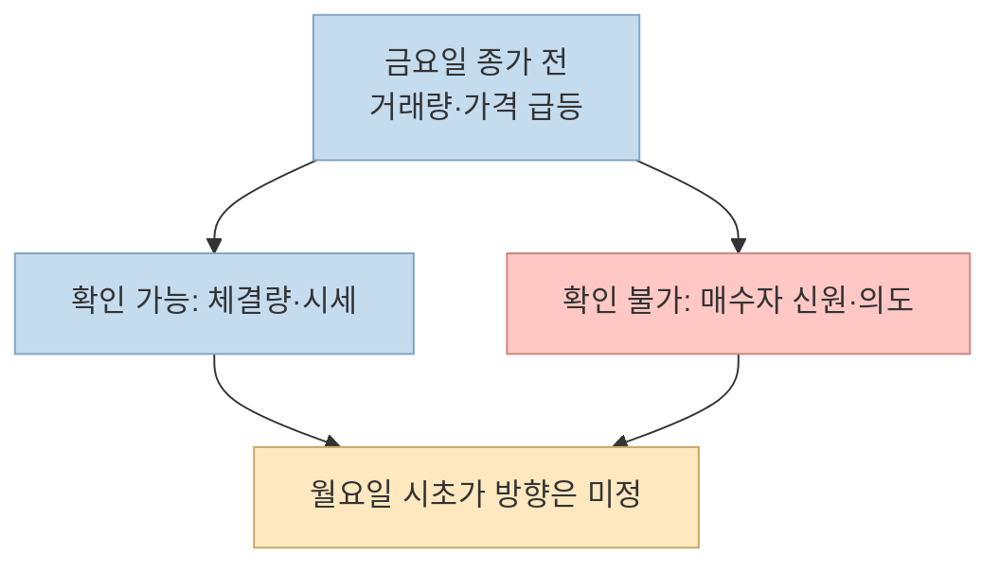
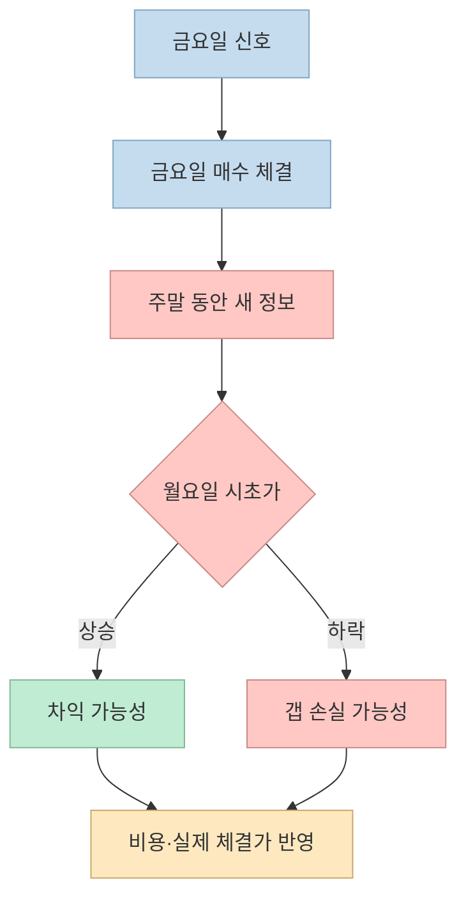

금요일 장마감 직전 거래량이 급증하고 당일 고점을 돌파한 종목을 사면 월요일 갭상승을 노릴 수 있다는 쇼츠가 있다. **관찰 가능한 가격·거래량 현상** 과 **누가 왜 샀는지**, **다음 거래일 수익이 날지** 는 서로 다른 질문이다. 영상의 인물·수익 주장부터 매매 논리까지 나눠 살펴본다.

<!--more-->

## Sources

- [원본 YouTube Shorts](https://youtube.com/shorts/A9Z1xA8w7a0?si=nw6bwUiVE5USmvCn) — 한국어 자동 생성 자막의 시간대별 발언을 확인했다. 제목·채널명은 YouTube 공개 oEmbed 메타데이터로 대조했다.
- [Nasdaq: 개장·종가 교차매매와 주문 불균형 정보](https://m.nasdaqtrader.com/Trader.aspx?id=OpenClose)
- [미국 SEC: 기관투자자의 Form 13F 공시](https://www.investor.gov/introduction-investing/investing-basics/glossary/form-13f-reports-filed-institutional-investment)
- [미국 SEC: SNS 기반 단기매매 위험](https://www.investor.gov/introduction-investing/general-resources/news-alerts/alerts-bulletins/investor-alerts/investor-alert-thinking-about-investing-latest-hot-stock-understand-significant-risks-short-term), [단타매매의 위험](https://www.sec.gov/files/investor/pubs/daytips.htm)

## 먼저 검증할 것: 인물·수익·인터뷰가 확인되는가

영상은 [초반](https://youtu.be/A9Z1xA8w7a0?t=3)에 ‘미국에서 8년 연속 기관투자 세계 1위 수상자’를 소개하고, [중반](https://youtu.be/A9Z1xA8w7a0?t=15)에는 자동 자막상 ‘데빈 베이커’가 23조 원을 벌었다고 말한다. 그러나 YouTube의 **영상 제목은 ‘8년 동안 32조 원’** 이라고 적혀 있어 같은 영상 안에서도 수치가 다르다. 확인 가능한 수상 기관·상 이름·연도·원 인터뷰 링크·검증된 운용 성과 자료가 제시되지 않았고, 해당 이름과 발언을 일치시키는 신뢰할 만한 원자료도 찾지 못했다. 자동 자막의 이름이 잘못 인식됐을 가능성까지 있으므로 **인물의 실재 여부나 수익액을 단정할 수 없다**.

이 불확실성은 사소한 숫자 오류가 아니다. ‘권위 있는 투자자가 실제로 사용해 큰돈을 벌었다’는 이야기가 매매 신호를 설득하는 근거로 쓰이기 때문이다. 원 인터뷰와 성과 자료가 없다면 영상의 전략 설명은 **검증된 전문가 기법이 아닌 쇼츠에서 제시한 주장** 으로 다뤄야 한다.

## 영상의 매매 논리: 관찰에서 예측으로 건너뛰는 지점

[29~36초](https://youtu.be/A9Z1xA8w7a0?t=29)의 제안은 금요일 오후까지 움직임이 적다가 장마감 30분 전 거래량이 갑자기 늘고 당일 고점을 돌파한 종목을 찾는 것이다. 이 조건의 **가격·거래량 패턴 자체** 는 시세 자료로 관찰할 수 있다. 그러나 ‘움직임이 없던 종목’, ‘거래량이 터졌다’, ‘고점 돌파’의 기간과 기준치가 없어, 그대로는 재현 가능한 매매 규칙이 아니다. 또한 장마감 30분 전의 ‘당일 고점’이라면 **그 시점까지 형성된 고점** 으로 정의해야 하며, 나중에 확정된 하루 전체 고점을 신호 판정에 사용하면 미래 정보를 미리 아는 오류가 생긴다.

[38~44초](https://youtu.be/A9Z1xA8w7a0?t=38)에는 ‘큰돈을 굴리는 사람들이 금요일 저녁에 사는 것은 월요일 갭상승을 시키려는 뜻’이라는 해석이 나온다. 하지만 거래량 증가는 **체결된 주식의 양** 을 보여 줄 뿐, 공개된 분봉만으로 매수자의 신원이나 의도를 알려주지 않는다. 매수 체결에는 상대방의 매도도 있다. 미국에서 규모가 큰 기관의 보유 내역을 볼 수 있는 [Form 13F](https://www.investor.gov/introduction-investing/investing-basics/glossary/form-13f-reports-filed-institutional-investment)조차 분기말 기준 보유 현황을 분기 종료 후 최대 45일 안에 공시하는 방식이지, 그 금요일 종가 직전의 매수자를 실시간으로 확인하는 자료가 아니다.

장마감 수급에는 다른 설명도 가능하다. 예를 들어 [Nasdaq 공식 안내](https://m.nasdaqtrader.com/Trader.aspx?id=OpenClose)는 **매 거래일** 미 동부시간 15:50~16:00에 종가 교차매매의 주문 불균형 정보를 제공하고, 16:00에 종가 교차매매를 실시한다고 설명한다. 이는 장마감 직전 주문이 모일 수 있는 제도적 배경을 보여 주지만, **영상 속 특정 종목의 거래량 급증 원인을 확인해 주는 자료는 아니다**. 금요일이라는 이유만으로 월요일 상승을 의도한 기관 매수로 해석할 수 없다.

## ‘따라 사면 돈을 번다’는 결론에 빠진 검증

영상은 [44~52초](https://youtu.be/A9Z1xA8w7a0?t=44)에 이런 종목을 따라 사면 수익이 난다는 취지로 말한다. 이를 주장하려면 먼저 시장·종목 범위, 금요일 신호의 정확한 수치, 매수 체결 시점, 월요일 매도 시점, 손절 조건을 정하고 **모든 해당 사례의 수익과 손실** 을 집계해야 한다. 상승한 사례 몇 개만 보여 주는 것은 검증이 아니다.

특히 금요일 종가에 보유한 주식은 주말의 실적·정책·기업 공시 등 새로운 정보에 노출된다. 월요일에 **위로 갭이 뜰 수도, 아래로 갭이 뜰 수도** 있으며, 매매 비용과 슬리피지를 제하면 화면상의 가격 차이가 실제 수익으로 남지 않을 수 있다. 미국 [SEC의 단타매매 안내](https://www.sec.gov/files/investor/pubs/daytips.htm)는 하루를 넘겨 보유할 때 가격이 급격히 바뀔 위험을 지적하고, [SNS 단기매매 경고](https://www.investor.gov/introduction-investing/general-resources/news-alerts/alerts-bulletins/investor-alerts/investor-alert-thinking-about-investing-latest-hot-stock-understand-significant-risks-short-term)는 온라인의 ‘급등주’ 추종에 손실 위험이 크다고 설명한다.

## 실전 적용 포인트: 매매보다 검증을 먼저

1. **원출처 확인:** 영상 속 수상자·인터뷰·운용 성과의 공식 기록을 요구한다. 제목과 자막의 수익액이 다른 이유도 확인한다.
2. **신호 수치화:** 예를 들어 ‘거래량 폭증’을 직전 여러 주의 같은 시간대 거래량 대비 몇 배인지 정의하고, 고점은 신호 시점까지의 가격만으로 계산한다. 이는 검증을 위한 예시이지 추천 매매 기준이 아니다.
3. **전체 사례 점검:** 신호가 나타난 모든 종목을 포함해 상승·하락 비율과 손익 분포를 살핀다. 장마감 직전 체결 가능성과 월요일 시초가 매도 가능성도 보수적으로 반영한다.
4. **위험 한도 설정:** 손실이 나도 생활비에 영향을 주지 않을 금액만 고려한다. 결과가 확인되기 전에는 ‘기관 따라 사기’라는 설명만으로 실거래하지 않는다.

## 핵심 요약

- 쇼츠 제목은 **32조 원**, 자동 자막은 **23조 원**으로 서로 다르며, 인물·수상·원 인터뷰는 확인되지 않았다.
- 금요일 종가 전 거래량 급증은 관찰할 수 있어도 **기관의 매수 의도나 월요일 갭상승을 증명하지 않는다**.
- 수익성 주장은 모든 신호 사례, 실제 체결가, 비용, 주말 위험을 포함한 검증이 있어야 평가할 수 있다.

## 결론

금요일 장마감 수급은 분석할 만한 현상이다. 그러나 [영상이 제시한](https://youtu.be/A9Z1xA8w7a0?t=23) ‘금요일 종가 급등 → 기관의 의도 → 월요일 갭상승 → 쉬운 수익’은 각 단계가 검증되지 않은 추론의 연쇄다. 쇼츠를 매매 지시가 아니라 **검증할 가설** 로 취급하는 편이 안전하다.
